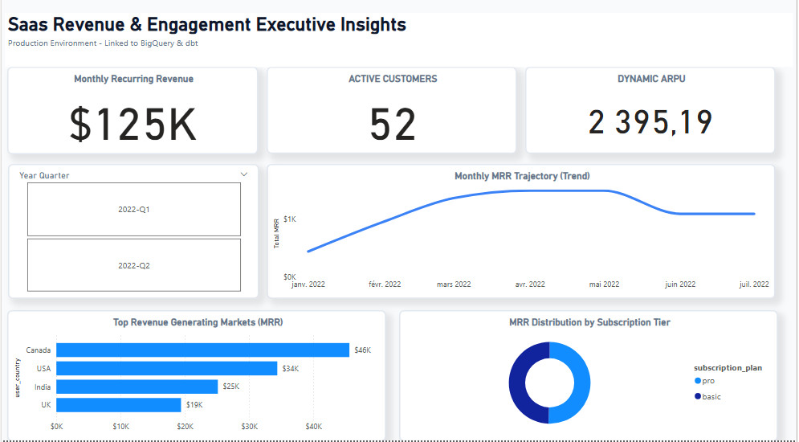

# 🚀 SaaS Revenue Analytics Pipeline (End-to-End)

End-to-end **Analytics Engineering project** built with **Google BigQuery, dbt Core, and Power BI**.

This project transforms raw SaaS subscription data into reliable financial metrics such as **MRR, ARPU, and active customers**, enabling data-driven decision-making.

---

# 🧱 Architecture Overview

```text
Raw Operational Data (CSV)
        ↓
Google BigQuery (Data Warehouse)
        ↓
dbt Staging Models (Cleaning & Standardization)
        ↓
dbt Intermediate Models (Business Logic)
        ↓
dbt Marts (Final Metrics Layer)
        ↓
Power BI Dashboards
```

---

# 🎯 Business Objective

The goal of this project is to build a **single source of truth** for SaaS analytics:

* Clean and standardize raw subscription data
* Structure transformations using dbt layers
* Build key SaaS KPIs (MRR, ARPU, Active Customers)
* Enable reporting for Finance and Revenue teams

---

# 📊 Key Metrics

## Revenue & Subscription Analytics

* **Monthly Recurring Revenue (MRR)**: monthly revenue tracking
* **Active Customers**: number of paying users per month
* **Average Revenue Per User (ARPU)**: revenue per active user
* **Revenue by Geography**
* **Subscription Tier Distribution**

---

# 🏗️ dbt Data Model Structure

```text
models/
│
├── staging/
│   ├── stg_users.sql
│   └── stg_subscriptions.sql
|   └── stg_events.sql
│
├── intermediate/
│   └── int_subscription_users.sql
│
└── marts/
    ├── dim_month.sql
    └── fct_mrr.sql
```

### Data Modeling Approach

* **Staging**: raw data cleaning and standardization
* **Intermediate**: business logic and joins
* **Marts**: final reporting tables
* Fact grain: **User × Month**

---

# 🧪 Data Quality & Testing

* `unique` and `not_null` tests on primary keys
* Referential integrity between users and subscriptions
* Prevention of duplicate monthly revenue records
* Composite key validation (user_id + month)

---

# 📊 Dashboard Layer (Power BI)

A Power BI dashboard was built on top of dbt marts to provide clear visibility into SaaS financial performance. The dashboard enables monitoring of key business KPIs including:

* **Monthly Recurring Revenue (MRR)** trends over time
* **Active Customers** measured as unique paying users per month
* **Average Revenue Per User (ARPU)** computation
* **Revenue segmentation** by geographic market
* **Subscription tier distribution** (Basic vs Pro plans)

This layer is designed to support decision-making for Finance and Revenue Operations teams.

📸 Dashboard Preview:


---

### 📐 dbt Lineage Graph


---
# 🛠️ Technology Stack

| Layer          | Technology   |
| -------------- | ------------ |
| Data Warehouse | BigQuery     |
| Transformation | dbt Core     |
| Visualization  | Power BI     |
| Versioning     | Git & GitHub |

---

# ⚙️ How to Run

```bash
dbt deps
dbt run
dbt test
dbt docs generate && dbt docs serve
```

---

# 📌 Conclusion

This project demonstrates an end-to-end analytics pipeline using a modern data stack.
It highlights skills in **data modeling, analytics engineering, and BI dashboarding using BigQuery and dbt**.
